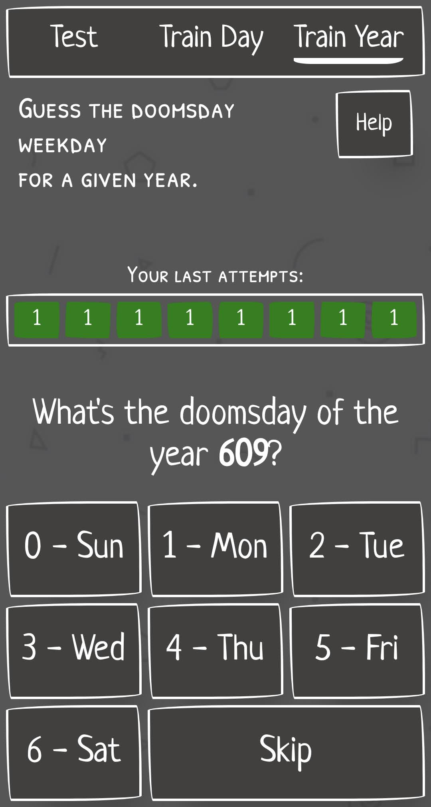
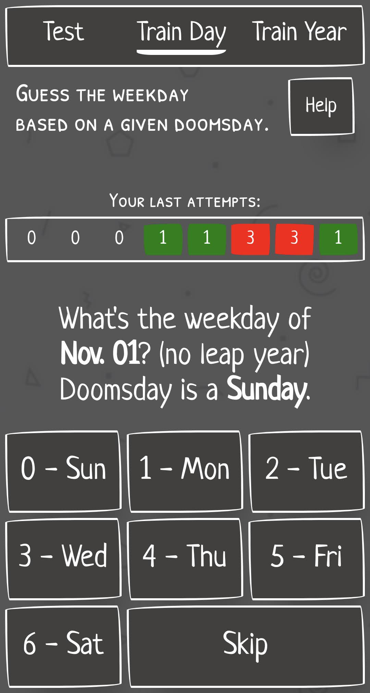
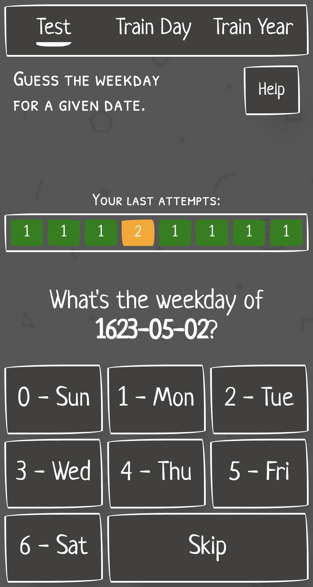
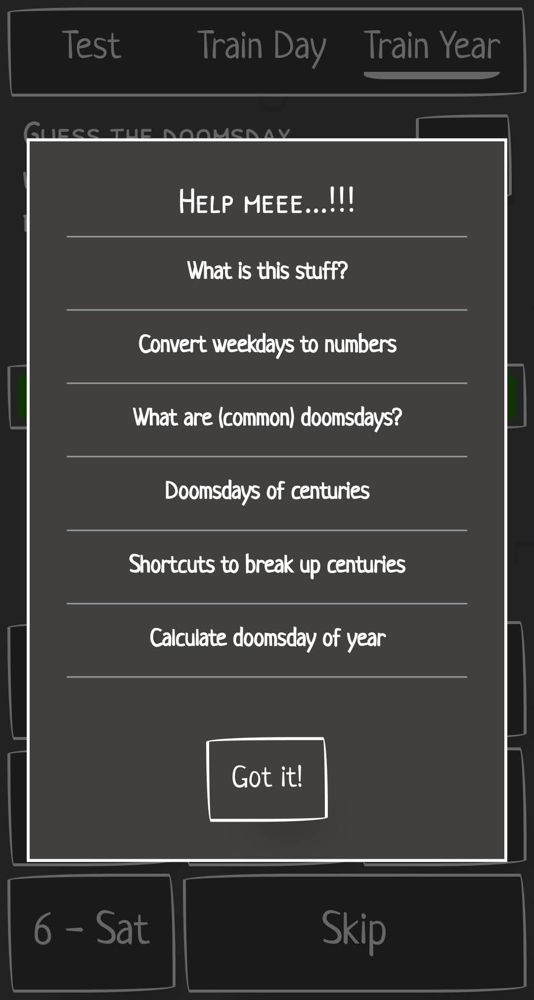
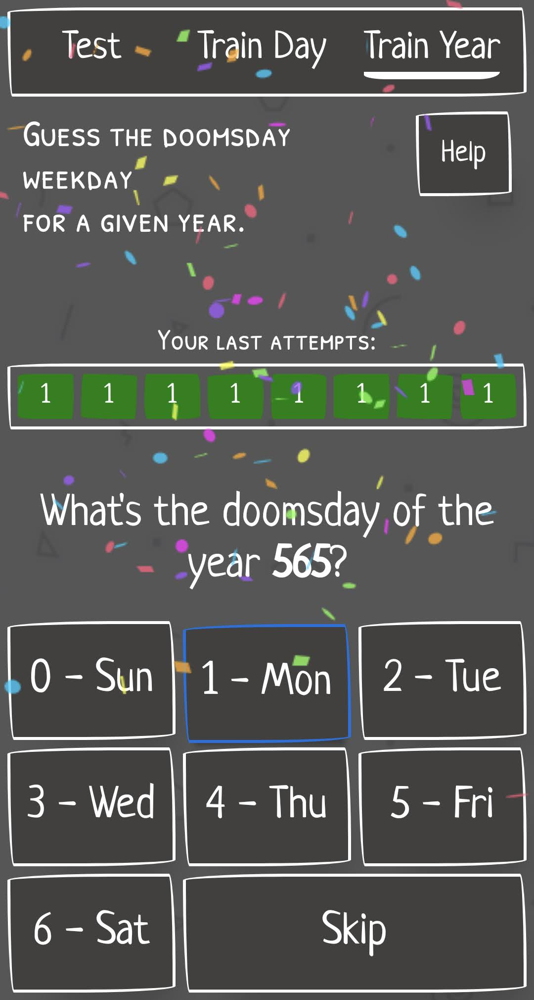

# Doomsday Trainer

A webapp to learn the doomsday method of calculating the day of week for every date.

📱 Check it out on: [doomsday.adrianjost.dev](https://doomsday.adrianjost.dev).

## Features

The webapp features 3 training views which you can use to learn the required parts.

| Calculate a Doomsday                                     | Get the weekday with a given Doomsday                    | and putting it all together                                    |
| -------------------------------------------------------- | -------------------------------------------------------- | -------------------------------------------------------------- |
|  |  |  |

If you are stuck, there is always a little help available.

And of course there is confetti to spark some joy when you did it. 🥳

